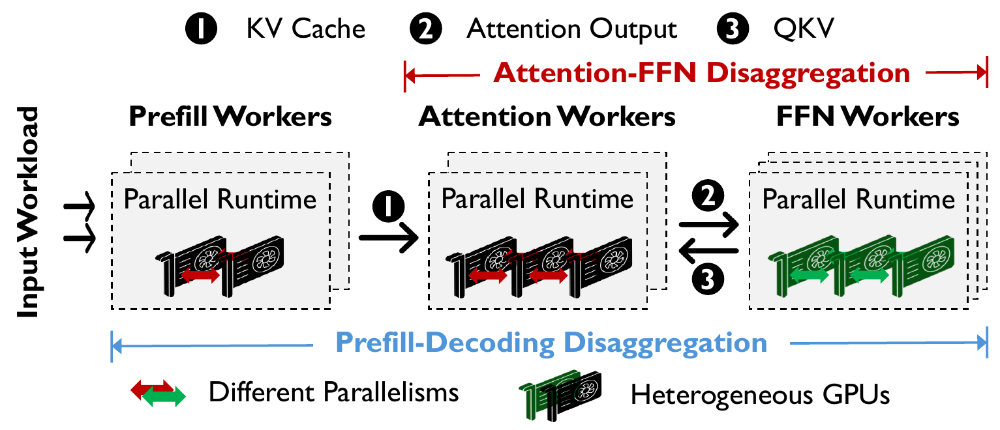

<h2 align="center">HexGen-3: A Fully Disaggregated LLM Serving Framework with Fine-Grained Heterogeneous Resource Autoscaling</h2>

<p align="center">
  <a href="https://arxiv.org/pdf/2311.11514">
    
  </a>
  <a href="https://proceedings.iclr.cc/paper_files/paper/2025/file/0b941a1e5fbce23fe46b049999d04ed0-Paper-Conference.pdf">
    
  </a>
  <a href="https://openreview.net/pdf?id=fVG57FKBNp">
    
  </a>
</p>

<p align="center">
  <i>This repository provides HexGen-3's core scheduling and runtime workflow.</i>
</p>

---

## Introduction

Production LLM serving must accommodate substantial variation in request rates,
input and output lengths, and the computational characteristics of available
GPUs. Conventional deployments couple multiple inference operations within the
same replicas, limiting the ability to allocate and scale resources according to
each operation's workload and hardware requirements. These constraints can lead
to inefficient resource utilization and make it difficult to maintain
cost-effective serving as demand changes.

**HexGen-3** addresses these challenges with a **fully disaggregated
architecture** that separates prefill, decode-attention, and decode-FFN into
independently scalable workers. Its **hierarchical scheduling framework** jointly
optimizes heterogeneous resource allocation and parallelism configurations,
allowing each inference operation to use resources and parallel strategies
suited to its computational characteristics. At runtime, a **fine-grained
autoscaler** adjusts resources and reschedules the deployment as the workload
changes. This release integrates the SGLang-based serving runtime, the StepMesh
Attention-FFN communication layer, the scheduler and autoscaler, sample
workloads, and generated artifacts needed to exercise HexGen-3's core workflow.

<p align="center">
  
</p>

<p align="center">
  <sub>Figure 1. HexGen-3's fully disaggregated serving architecture.</sub>
</p>

## Repository Structure

```text
.
├── runtime/     # SGLang-based fully disaggregated serving runtime
├── comm/        # StepMesh-based Attention-FFN communication layer
├── scheduler/   # Hierarchical scheduler and autoscaling framework
└── data/        # sample workloads and generated artifacts
```

## Requirements

Verified environment:

- Ubuntu 22.04
- Python 3.12
- CUDA 12.4
- Linux kernel 5.15.0

Full AFD serving requires a working GPU/RDMA setup. Check CUDA driver
compatibility, RDMA NIC name, `nvidia-peermem`, model path, node IP addresses,
and GPU topology before launching the runtime.

## Installation

Create a clean Python environment:

```bash
conda create -n hexgen python=3.12 -y
conda activate hexgen
pip install --upgrade pip
```

Install Mooncake for KV cache transfer in prefill-decode disaggregation:

```bash
pip install mooncake-transfer-engine
```

Build and install the StepMesh-based communication layer for Attention-FFN
disaggregation:

```bash
cd /path/to/HexGen-3-release/comm
bash tools/install_deps.sh
make af
pip install -v -e .
```

Optional StepMesh check:

```bash
sudo modprobe nvidia-peermem
ROLE=joint RNIC="<StepMesh network interface>" \
  bash tests/fserver/run_single_gpu.sh
```

Install the runtime:

```bash
cd /path/to/HexGen-3-release/runtime
pip install -e "python[srt]"
pip install -e "python[openai]"
```

Install scheduler dependencies:

```bash
cd /path/to/HexGen-3-release/scheduler
pip install -r requirements.txt
```

## Quick Start

### Manual Runtime

The single-node example below launches one prefill worker, one two-GPU
decode-attention worker, one decode-FFN worker, and one mini load balancer. Run
each process in a separate shell and set these cluster-specific values in every
shell:

```bash
MODEL_PATH="/path/to/model"
AFD_HOST="<node IP address reachable by the attention and FFN workers>"
STEPMESH_INTERFACE="<network interface used by StepMesh>"
RDMA_DEVICE="<RDMA device used for prefill-decode KV transfer>"
PREFILL_GPU="<prefill GPU ID>"
ATTENTION_GPUS="<two comma-separated attention GPU IDs>"
FFN_GPU="<FFN GPU ID>"
```

`STEPMESH_INTERFACE` is a network interface, while `RDMA_DEVICE` is the device
accepted by `--disaggregation-ib-device`; they need not have the same name.

Launch the prefill worker:

```bash
cd /path/to/HexGen-3-release/runtime

export CUDA_VISIBLE_DEVICES="$PREFILL_GPU"
export SGLANG_DISAGGREGATION_BOOTSTRAP_TIMEOUT=1200

python -m sglang.launch_server \
  --model-path "$MODEL_PATH" \
  --disable-overlap-schedule \
  --disable-cuda-graph \
  --disaggregation-mode prefill \
  --disaggregation-ib-device "$RDMA_DEVICE" \
  --disaggregation-bootstrap-port 9001 \
  --host 127.0.0.1 \
  --port 30001 \
  --chunked-prefill-size 65536 \
  --max-prefill-tokens 65536
```

Launch the decode-attention worker:

```bash
export CUDA_VISIBLE_DEVICES="$ATTENTION_GPUS"
export AFD_SCHED_HOST="$AFD_HOST"
export DMLC_PS_ROOT_URI="$AFD_HOST"
export DMLC_NODE_HOST="$AFD_HOST"
export MLC_INTERFACE="$STEPMESH_INTERFACE"

python -m sglang.launch_server \
  --model-path "$MODEL_PATH" \
  --disable-overlap-schedule \
  --disable-cuda-graph \
  --disaggregation-mode decode \
  --afd-perspective attn \
  --disaggregation-ib-device "$RDMA_DEVICE" \
  --disaggregation-bootstrap-port 9001 \
  --afd-mirco-batch 2 \
  --port 30002 \
  --chunked-prefill-size 65536 \
  --max-prefill-tokens 65536 \
  --tp 2
```

Launch the decode-FFN worker:

```bash
export CUDA_VISIBLE_DEVICES="$FFN_GPU"
export AFD_SCHED_HOST="$AFD_HOST"
export DMLC_PS_ROOT_URI="$AFD_HOST"
export DMLC_NODE_HOST="$AFD_HOST"
export MLC_INTERFACE="$STEPMESH_INTERFACE"

python -m sglang.launch_server \
  --model-path "$MODEL_PATH" \
  --disable-overlap-schedule \
  --disable-cuda-graph \
  --disaggregation-mode null \
  --skip-server-warmup \
  --afd-perspective ffn \
  --afd-mirco-batch 2 \
  --port 30003 \
  --chunked-prefill-size 65536 \
  --max-prefill-tokens 65536 \
  --mem-fraction-static 0.75
```

Start the mini load balancer:

```bash
python3 -m sglang.srt.disaggregation.mini_lb \
  --prefill http://127.0.0.1:30001 \
  --decode http://127.0.0.1:30002 \
  --host 127.0.0.1 \
  --port 30000
```

After the mini load balancer starts, send requests to:

```text
http://127.0.0.1:30000/generate
```

Useful checks:

```bash
python3 -m sglang.test.few_shot_gsm8k --num-questions 100 --port 30000

python -m sglang.bench_serving \
  --port 30000 \
  --backend sglang \
  --dataset-name random-ids \
  --random-range-ratio 1 \
  --random-input-len 1280 \
  --random-output-len 1280 \
  --num-prompt 200
```

### Live Autoscaler

Run from the repository root with a fresh artifact directory:

```bash
cd /path/to/HexGen-3-release

ARTIFACT_ROOT="$PWD/data/run_$(date +%Y%m%d_%H%M%S)"
mkdir -p "$ARTIFACT_ROOT/sglang_afd_metrics" "$ARTIFACT_ROOT/runtime_logs"

MODEL_PATH="/path/to/model"
CAPACITY="<available GPU inventory as JSON>"
GPU_IDS="<comma-separated local GPU IDs>"
AFD_SCHED_HOST="<node IP address reachable by the AFD workers>"
STEPMESH_INTERFACE="<network interface used by StepMesh>"
RDMA_DEVICE="<RDMA device used for prefill-decode KV transfer>"
MODEL_SIZE_BILLIONS="<model parameter count in billions>"
MODEL_SIZE_GB="<model weight size in GB>"
KV_BANDWIDTH_GBPS="<measured KV-transfer bandwidth in GB/s>"
ACTIVATION_BANDWIDTH_GBPS="<measured attention-FFN bandwidth in GB/s>"
RELOAD_BANDWIDTH_GBPS="<measured model reload bandwidth in GB/s>"
TARGET_UTILIZATION=0.75
HYSTERESIS=0.08
DECODE_WORKER_GPU_CHOICES="<allowed comma-separated decode worker GPU counts>"
AFD_MICRO_BATCH=2
STABILITY_WINDOW_S=300
POLL_INTERVAL_S=40

SGLANG_ENABLE_AFD_METRICS=true \
SGLANG_AFD_METRICS_DIR="$ARTIFACT_ROOT/sglang_afd_metrics" \
python -u scheduler/cli/run_hexgen3_live_autoscaler.py \
  --metrics-dir "$ARTIFACT_ROOT/sglang_afd_metrics" \
  --capacity "$CAPACITY" \
  --initial-allocation '{"pre":1,"attn":1,"ffn":1}' \
  --model-path "$MODEL_PATH" \
  --model-size-billions "$MODEL_SIZE_BILLIONS" \
  --model-size-gb "$MODEL_SIZE_GB" \
  --kv-transfer-bandwidth-gbps "$KV_BANDWIDTH_GBPS" \
  --activation-bandwidth-gbps "$ACTIVATION_BANDWIDTH_GBPS" \
  --cost-aware \
  --stability-window-s "$STABILITY_WINDOW_S" \
  --reload-bandwidth-gbps "$RELOAD_BANDWIDTH_GBPS" \
  --target-utilization "$TARGET_UTILIZATION" \
  --hysteresis "$HYSTERESIS" \
  --decode-worker-gpu-choices "$DECODE_WORKER_GPU_CHOICES" \
  --afd-micro-batch "$AFD_MICRO_BATCH" \
  --afd-sched-host "$AFD_SCHED_HOST" \
  --mlc-interface "$STEPMESH_INTERFACE" \
  --disaggregation-ib-device "$RDMA_DEVICE" \
  --gpu-ids "$GPU_IDS" \
  --output "$ARTIFACT_ROOT/hexgen3_live_autoscaling_plan.json" \
  --runtime-cwd "$PWD/runtime" \
  --runtime-log-dir "$ARTIFACT_ROOT/runtime_logs" \
  --runtime-pid-file "$ARTIFACT_ROOT/hexgen3_runtime_pids.json" \
  --drain-state-file "$ARTIFACT_ROOT/afd_runtime_state.json" \
  --apply-runtime \
  --poll-interval-s "$POLL_INTERVAL_S"
```

Replace every angle-bracketed description before running. `CAPACITY` must be a
JSON object keyed by the scheduler's GPU type name. Set the model metadata and
bandwidths to match the target environment, and choose autoscaling policy values
appropriate for the available GPU inventory.

To exercise autoscaling, replay the included two-stage trace through the mini
load balancer. The trace starts with a low balanced workload and then switches to
a higher decode-heavy workload.

```bash
cd /path/to/HexGen-3-release

python scheduler/cli/run_hexgen3_live_autoscaler_trace_replay.py \
  --trace data/hexgen3_decode_workload_trace.json \
  --host 127.0.0.1 \
  --port 30000 \
  --arrival-process deterministic \
  --max-concurrency 2000
```

## Citation

If you find HexGen useful, please cite the HexGen family of papers:

```bibtex
@inproceedings{jianghexgen,
  title={HexGen: Generative Inference of Large Language Model over Heterogeneous Environment},
  author={JIANG, YOUHE and Yan, Ran and Yao, Xiaozhe and Zhou, Yang and Chen, Beidi and Yuan, Binhang},
  booktitle={Forty-first International Conference on Machine Learning}
}

@inproceedings{jianghexgen2,
  title={HexGen-2: Disaggregated Generative Inference of LLMs in Heterogeneous Environment},
  author={JIANG, YOUHE and Yan, Ran and Yuan, Binhang},
  booktitle={The Thirteenth International Conference on Learning Representations}
}

@inproceedings{jiangdemystifying,
  title={Demystifying Cost-Efficiency in LLM Serving over Heterogeneous GPUs},
  author={JIANG, YOUHE and Fu, Fangcheng and Yao, Xiaozhe and HE, Guoliang and Miao, Xupeng and Klimovic, Ana and CUI, Bin and Yuan, Binhang and Yoneki, Eiko},
  booktitle={Forty-second International Conference on Machine Learning}
}

@inproceedings{jianghexgen3,
  title={HexGen-3: A Fully Disaggregated LLM Serving Framework with Fine-Grained Heterogeneous Resource Autoscaling},
  author={Jiang, Youhe and Li, Wenshuang and Peng, You and Zhang, Jintao and Yan, Ran and Chen, Jianfei and Han, Xu and Fu, Fangcheng and Yuan, Binhang},
  booktitle={Forty-third International Conference on Machine Learning}
}
```
